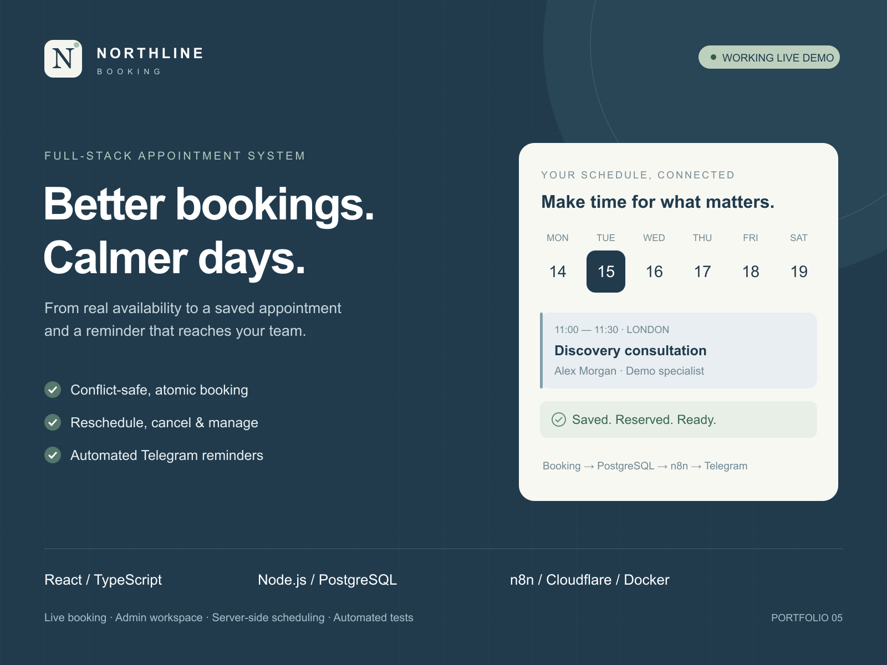
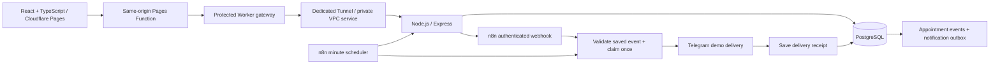

# Northline Booking

A working appointment system that takes a service business from **live availability to a saved booking, a clear team schedule and a delivered reminder**.

**[Live demo](https://booking-appointment-demo.pages.dev/)** · **[GitHub](https://github.com/ScorpionD/booking-appointment-demo)**



**58 automated tests passed** · **Production build verified** · **Real booking and scheduled Telegram delivery verified**

[Eight real application screenshots](artifacts/README.md) · [Production verification record](docs/verification.md)

## Business use case

Consultants, repair teams, salons and service centres need a reliable way to accept appointments without trading messages about available times. Customers need the freedom to change their plans. Staff need one schedule and a dependable record of what happened.

Northline connects that entire journey. The interface is backed by a real Express API and PostgreSQL. Availability comes from working hours, service duration, lunch breaks, blocked periods and existing reservations. A transactional database constraint prevents overlapping appointments even when concurrent requests reach the server.

**Portfolio demonstration:** services, people and prices are fictional. No payment, real service delivery or customer email is involved. Use test contact details only. Each visitor receives an isolated 48-hour workspace; the demo admin role can manage only that workspace. Appointments within the same workspace compete for the same staff schedule. The business timezone is **Europe/London**, including daylight-saving changes.

## Features

- Six services and four specialists with assigned specialties, duration, demo price, working hours and active status.
- Public booking: service → specialist or any available → date → real available start time → customer details → saved appointment and booking reference.
- Secure management link, rescheduling, cancellation and restored appointment history after page refresh.
- Atomic bookings, half-open interval overlap protection, idempotent retries and optimistic version checks.
- Admin role selection, filtered appointments list and day view, manual booking, confirmed/completed/no-show statuses, services and staff management.
- Editable weekly working periods, lunch breaks and blocked time; schedule changes cannot strand existing appointments.
- PostgreSQL appointment events and a transactional notification outbox.
- Separate n8n workflow for booking, rescheduling and cancellation alerts through Telegram.
- Scheduled reminders checked every minute, plus a one-click test reminder for an upcoming appointment.
- Delivery receipts, duplicate-send claim protection and manual-review status for ambiguous Telegram responses.
- Validation, protected session cookies, CSRF/origin checks, request limits, rate limits, private origin authentication and server-only secrets.
- Responsive frontend with loading, empty, conflict and error states. No fabricated availability or success confirmations.

## Architecture



The API, PostgreSQL, n8n, networks, volumes and tunnel belong to this project. The production API and database expose no public host ports. n8n's editor binds to server loopback only. The public Worker denies every `/api/automation/*` route and has no `workers.dev` endpoint.

### Booking and availability

1. The API creates a private anonymous workspace and seeds its services/team.
2. Availability converts London working periods into UTC instants at 15-minute start intervals. A slot must fit the full service duration, leave a 30-minute notice period and avoid busy intervals. Booking is limited to the next 30 days.
3. Mutations take a transaction-scoped advisory lock for the workspace, recheck availability and save the appointment, event and notification together.
4. A PostgreSQL `EXCLUDE USING gist` constraint over workspace, specialist and `tstzrange` is a second independent defence against overlap. Adjacent appointments are allowed; intersecting ones are not.
5. Duplicate submission keys return the existing booking only if the request contents match. A failed reschedule rolls back, keeping the original slot reserved.
6. Cancellation releases availability while preserving the appointment/event history. Closed appointments cannot be reopened. Completion and no-show are allowed only after the start time.

See [PostgreSQL range constraints](https://www.postgresql.org/docs/current/rangetypes.html#RANGETYPES-CONSTRAINT) and [API documentation](docs/api.md).

### Data model

| Entity                    | Purpose                                                                                                         |
| ------------------------- | --------------------------------------------------------------------------------------------------------------- |
| `workspaces`              | Hashed anonymous session, CSRF value, scoped demo role and expiry                                               |
| `services`                | Duration, price in integer pence, description and active status                                                 |
| `staff`, `staff_services` | Team profiles and supported services                                                                            |
| `working_hours`           | One or more local-time periods per weekday; gaps represent breaks                                               |
| `blocked_times`           | Unavailable intervals such as meetings or leave                                                                 |
| `appointments`            | UTC time interval, status, customer details, service/staff snapshots, management-token hash and idempotency key |
| `appointment_events`      | Booking, reschedule, cancellation, status and reminder activity                                                 |
| `notifications`           | Durable outbox, event version, claim state and Telegram receipt                                                 |
| `usage_limits`            | Bounded anonymous workspace creation and global Telegram delivery allowance                                     |

An appointment has a general revision for stale-write protection and a separate schedule revision for reminder validity. Confirming a visit does not invalidate its reminder. Rescheduling invalidates old pending reminders and schedules a new one. Booking snapshots preserve the agreed service details when future service configuration changes.

### Automation and reminders

The runnable generator is [n8n/workflow.mjs](n8n/workflow.mjs). Deployment supplies credential references privately.

- A saved booking immediately attempts the authenticated n8n webhook. Booking confirmation never depends on Telegram availability.
- The n8n schedule trigger runs every minute, creates due reminder events and picks up pending outbox events. A missed webhook remains in the queue.
- Each event must obtain an atomic database send claim before Telegram is called. Concurrent or repeated workflow executions cannot claim it twice.
- n8n sends the booking number, customer name, service, specialist, London date/time and event/status. Email, phone and customer notes are not sent to Telegram.
- Successful delivery stores the Telegram message reference. A timeout, uncertain result or abandoned claim is marked `review`; it is not blindly resent. Receipt writes can be retried safely.
- The reminder target is 24 hours before the appointment. For a booking closer than 24 hours away, the target is five minutes after creation. The scheduler skips expired, cancelled, past or outdated reminders.
- In Admin, open an upcoming appointment and select **Send test reminder**. One test reminder is permitted per schedule version and follows the same n8n/Telegram delivery path.
- Public demo delivery is capped at 60 claimed Telegram sends per hour across workspaces. Excess events remain queued for a later attempt; saved appointments remain available.

This is a real scheduled workflow, not a browser timer. Delivery runs on the server even after the page closes. Telegram acts as the demonstration delivery channel; a commercial implementation can substitute consented email/SMS/WhatsApp adapters. See [n8n Schedule Trigger documentation](https://docs.n8n.io/integrations/builtin/core-nodes/n8n-nodes-base.scheduletrigger/).

## What this project demonstrates

Full-stack React/TypeScript and Node development; REST API design; timezone-aware scheduling; PostgreSQL transactions and exclusion constraints; concurrency and stale-write handling; secure booking management; admin workflows; resilient automation; real database integration tests; responsive UX; isolated Docker deployment and Cloudflare delivery.

AI is deliberately omitted: this case demonstrates booking correctness and operational workflows. It has no paid LLM dependency and no invented scheduling suggestions.

## Tests and verification

```sh
npm run lint
npm test
npm run build
```

The API suite requires **a separate PostgreSQL database named `booking_test`** and refuses any other database name. It includes a real concurrent booking race, direct database overlap constraint test, duplicate submission replay, successful/failed reschedules, cancellation, released availability, role/session isolation, validation, admin editing, working-hour conflicts, notification claims, receipts, reminder scheduling and history persistence.

Unit tests check working hours, breaks, adjacent intervals, duration, lead time, summer/winter timezone conversion and status transitions. Frontend tests check service loading, unavailable slots, honest failures and backend history. Gateway/workflow tests verify protected internal routes, origin and size enforcement, header filtering and duplicate-delivery control.

`npm run test:unit` runs without a database. GitHub Actions creates its own disposable PostgreSQL 17 instance and runs lint, the full test suite and a production build. The final live evidence is recorded in [verification notes](docs/verification.md).

The production smoke runner deliberately requires an opt-in because it creates fictional bookings and sends real demo-manager Telegram notifications:

```sh
npm run smoke:production -- --confirm-test-bookings
```

It verifies the public gateway, concurrent conflict, idempotent replay, persisted history, rescheduling, status updates, cancellation, released slots and confirmed notification receipts. It leaves one upcoming test appointment for the minute scheduler; all demo records expire with their workspace. Evidence includes no cookies, management keys or operational secrets.

## Local setup

Use Node.js 22.13+ or Node 24, npm and Docker Compose v2.

```sh
git clone https://github.com/ScorpionD/booking-appointment-demo.git
cd booking-appointment-demo
cp .env.example .env
# Replace password/secret placeholders. DATABASE_URL values must match.
npm ci
docker compose up -d db
npm run dev:api
# In a second terminal:
npm run dev
```

Open `http://localhost:5173`. On Windows use `Copy-Item .env.example .env`. PostgreSQL binds to local port 55461, the development API uses 4300, and Vite proxies `/api`. Schema setup and reproducible workspace seeds are included. `npm run db:migrate` can run schema setup explicitly; pass the environment using your shell or `node --env-file=.env server/migrate.mjs`.

### Docker

```sh
docker compose up -d --build
```

This creates dedicated database, API and n8n services. The local n8n editor is at `http://localhost:5683`. Initialize its private owner before sharing access. Create an HTTP Header Auth credential with `X-Automation-Secret`, a Telegram credential and the demo manager chat ID. Generate/import the booking workflow with their credential IDs and publish it. Keep credentials and `N8N_ENCRYPTION_KEY` private.

Without configured n8n, bookings still save; notifications remain honestly pending. The UI never claims Telegram delivery without a receipt.

### Production deployment

| Cloudflare Pages setting | Value                                       |
| ------------------------ | ------------------------------------------- |
| Repository               | `ScorpionD/booking-appointment-demo`        |
| Branch                   | `main`                                      |
| Build command            | `npm run build`                             |
| Output                   | `dist`                                      |
| Node                     | `22`                                        |
| Production binding       | `BOOKING_API` → `northline-booking-gateway` |

On an isolated host, provide `.env` and `secrets/tunnel-token.txt` privately, configure the dedicated tunnel/VPC service in `worker/wrangler.jsonc`, and deploy with:

```sh
docker compose -f compose.yaml -f compose.production.yaml up -d --build
```

The production override removes API/database host ports. The tunnel token must be readable by the cloudflared container's UID 65532, while the host project directory and secret files remain private. Deploy the Worker and set its `ORIGIN_SECRET` through Cloudflare secrets. Never commit credential exports or operational environment files. Frontend GitHub deployment requires the Cloudflare GitHub App to have access to this repository; backend releases use the separate Docker deployment.

This project uses existing host capacity and free service allowances. [Cloudflare Workers VPC is currently free during its open beta](https://developers.cloudflare.com/workers-vpc/reference/pricing/); review future pricing before enabling paid resources.

## Screenshots

The [portfolio media gallery](artifacts/index.html) contains an original cover and eight screenshots of the real application: public page, service/date selection, available slots, confirmation, reschedule/cancel, admin schedule, reminders/automation and architecture/features. Additional 320/390/768/1440 layout evidence is in `artifacts/qa`.

## Customization and limitations

The architecture can be adapted for clinics, salons, automotive services, consultations, education, repairs and Calendly-like booking flows. **Google Calendar, Microsoft Outlook, email, SMS, WhatsApp and CRM are possible future integrations, not connected features.**

- Demo role selection is intentionally scoped to an anonymous workspace. A commercial rollout needs staff identity/SSO and business tenancy, retention policy, backups and monitoring.
- A secure management link grants access to one test booking and expires with its 48-hour workspace. The reference alone is not an access credential.
- Each visitor has an isolated schedule. A real business would share its tenant schedule across customers; concurrency protection already applies within that boundary.
- One business timezone, 15-minute start intervals, 30-minute advance notice and a 30-day booking window. No recurring appointments, multiple locations or resource/room scheduling.
- Up to 20 bookings, 15 services, eight specialists and 30 blocked periods per workspace. Session creation and public requests are rate limited.
- Prices are illustrative. No payments, real service fulfilment, customer email, SMS or external calendar synchronization.
- Telegram cannot guarantee exactly-once delivery after an ambiguous network result. Those events require human review. No automatic marketing messages are sent.
- An already sending reminder may arrive concurrently with a last-second cancellation; delivered messages cannot be retracted transactionally. Pending outdated reminders are cancelled.
