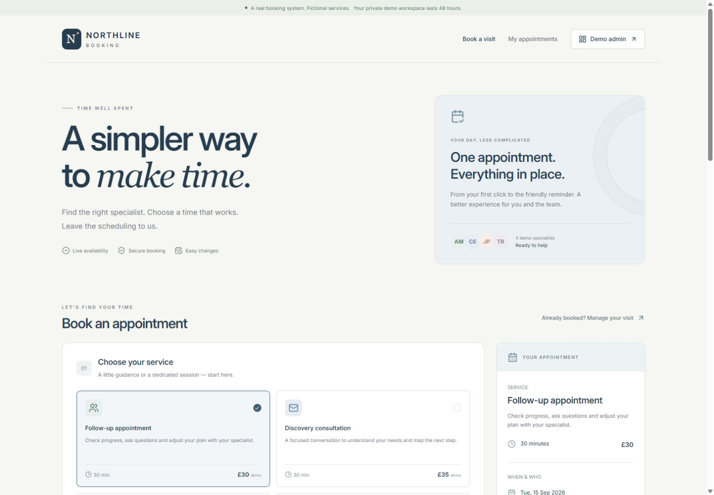
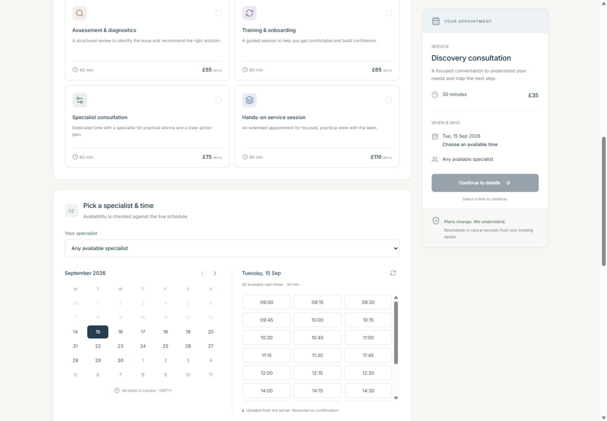
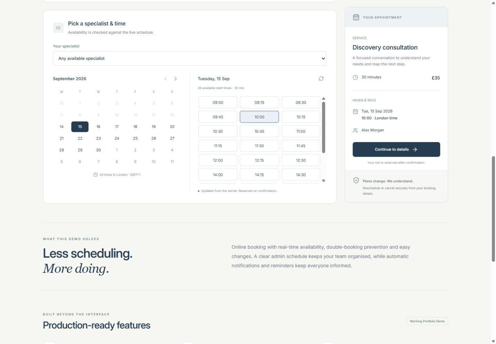
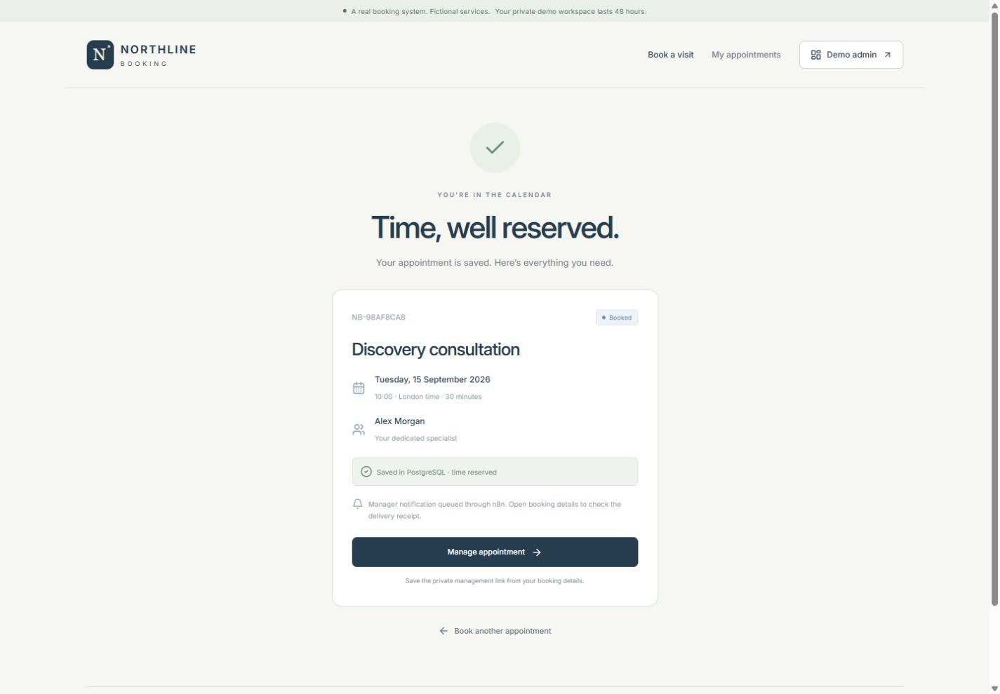
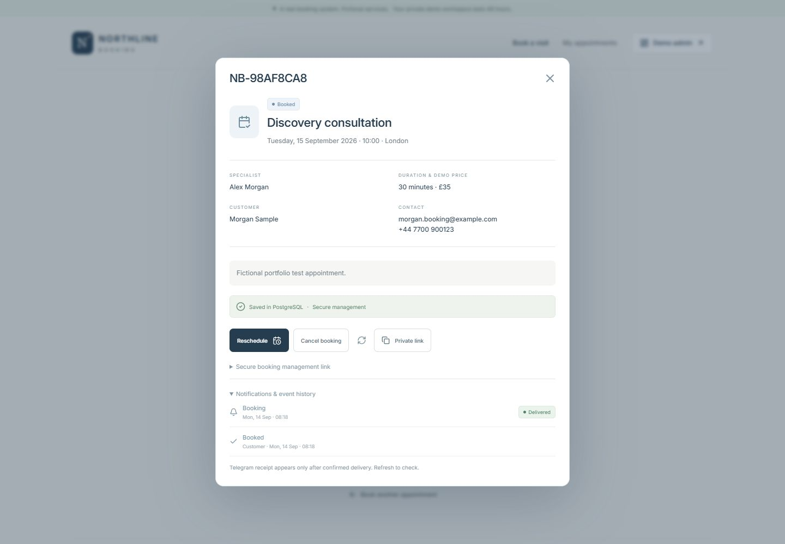
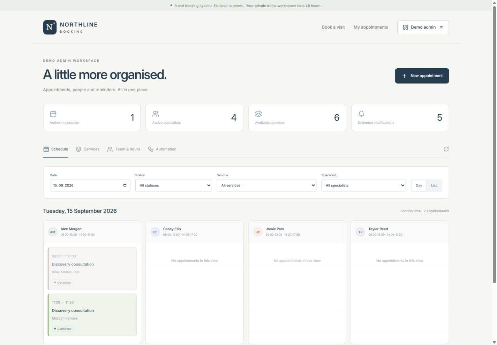
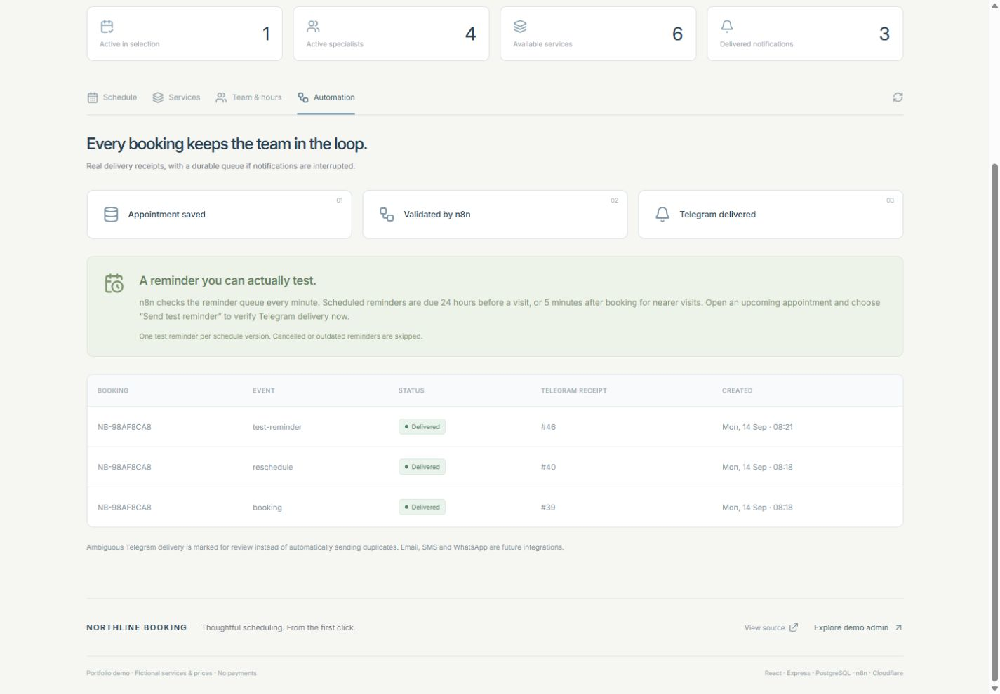
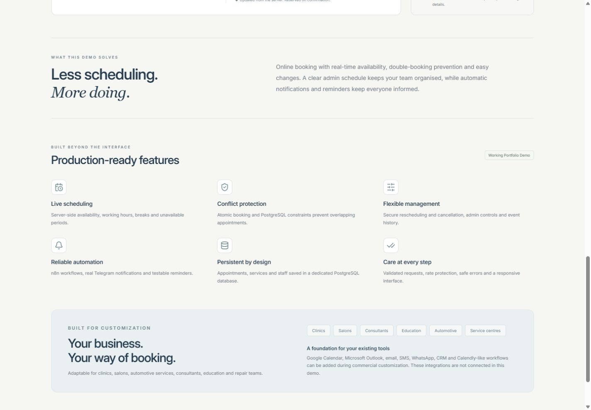

# Northline Booking — portfolio media

All eight screenshots below were captured from the real deployed application on 14 September 2026. Contact information and services are fictional. The original cover is a designed illustration of the booking experience, separate from the unaltered application screenshots.

[Live demo](https://booking-appointment-demo.pages.dev/) · [GitHub repository](https://github.com/ScorpionD/booking-appointment-demo) · [Local HTML gallery](index.html)

## Cover

1600 × 1200 PNG. Editable vector source: [cover.svg](cover.svg).

## 1. Public booking page

## 2. Service and date selection

## 3. Real available time slots

## 4. Saved booking confirmation

## 5. Secure management, reschedule and cancel

## 6. Admin schedule

## 7. Reminders and real automation receipts

## 8. Production features and customization

Additional mobile/tablet evidence is in [qa/](qa/). Production checks are documented in [verification.md](../docs/verification.md). Sample records expire after 48 hours; the screenshots record the verified release.
